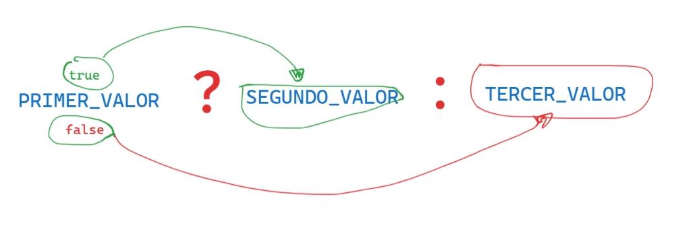

# Valores, Tipos y Operadores
## Indice
- [Valores, Tipos y Operadores](#valores-tipos-y-operadores)
  - [Indice](#indice)
  - [Valores](#valores)
    - [Datos Primitivos](#datos-primitivos)
      - [Numeros(Number)](#numerosnumber)
      - [Aritmetica](#aritmetica)
      - [Cadenas](#cadenas)
      - [Concatenacion](#concatenacion)
      - [Plantillas literales](#plantillas-literales)
      - [Operadores Unarios](#operadores-unarios)
      - [Valores Boleanos](#valores-boleanos)
      - [Operador Ternario](#operador-ternario)
## Valores
Imagina un mar de bits.
Una computadora moderna tiene mas de 100 mil millones de bits almacenados en su `memoria de trabajo`o`memoria principal`o`memoria volatil`o`ram`.
Ahora la memoria no volatil o memoria secundaria tiene estos bits de manera ordenanda general mente apilada como si de un estante de una biblioteca se tratara.
Cuando nosotros programamos hacemos uso de la `memoria de trabajo`, para trabajar de manera ordenada con los bits que se encuentran en nuestro mar de bits, JavaScript ordena los bits en pequeños partes o piezas de informacion, a esto se le conoce como `valores`.
Cada valor tiene una funcionalidad distinta; puede ser numero, texto o una funcion.
Cuando hablamos de tipos de datos en JavaScript nos referimos a su representacion binaria y el tipo de valor que usamos.
### Datos Primitivos
Son aquellos datos que ya existen, no pueden ser creados, actualizados ni eliminados, solo pueden ser llamados para elo uso que deseamos darle.
Los datos primitivos en JavaScript son:
#### Numeros(Number)
Los valores de tipo Numero, como es de esperar son numnero y en JavaScript se escribe o se hace el llamado del valor de la siguiente manera:
- numero de tipo entero
```js
20 //positivo
-20 //negativo
//estamos usando un patron de bits para el numero 20 que existia dentro de la memoria de trabajo.
//cantidad limite que se puede almacenar en un solo patron o cajita de 64bits  es de 2 elevado a 64. Por cada numero la representacion siempre sera 64 bits en javascript
```
- numero fraccional (punto flotante, decimal, franccion)
```js
2.7 
0.
.0 // positivo
-3,6 // negativo
// Cada numero equivale a 64 bits y se le agrega un  bit por el punto
// internamente java guarda los numero como flotante positivo independientemente de su tipo de numero
// Cuando crea un patron de bits para alamcenar todos los numeros los almacena como decimal positivo.
```
- numeros de tipo notacion cientifica
```js
2.998e8 // positivo
-2.46e8 // negativo
// es igual que decir 2.998^ 10*8
//e significa (*10)
```
> [!WARNING]
> Cuando javascript realiza operaciones con numeros enteros el resultado siempre sera exacta, cuando realice operacion con numeros decimales el resultado perdera presicion por que solo tiene 64 bits para alamacenar el numero, esto suele ocurrir con resultados cuyos decimales sean infinitos como en el caso de PI.
---
> [!TIP]
> cuando javascript hace trabajo de memoria(cuando crea un patron de bit para alamcenar) todos numero se almacena como decimal positivo.
- numeros especiales 
En javascript existen tres valores de tipo numero que se consideran un dato primitivo numerico de tipo especial
```js
infinity
- infinity // negativo
NaN // not a number
// cuando el resultado de una operacion es matematicamente imposible.
```
#### Aritmetica
la principal operacion que se se puede hacer con numeros es la aritmetica.
para esto tememos los Operadores aritmeticos basicos como:
- suma (+).
- resta (-).
- multiplicacion (*).
- division (/).
- potencia (**).
- modulo (%).
- incremento (++).
- decremento (--).
  
**podemos agrupar operaciones con parentesis () las operaciones ques este entre los parentesis se ejecutar primero**

consulta el archivos de operadores [aqui](./operadores.js).
ve los ejercicios [aqui](./ejercicios.js)
#### Cadenas
El siguiente tipo de dato primitivo es la `cadena` - `string`.
¿Para que se usan las cadenas en javascript?
- para representar texto
se escribe encerrando su contenido entre comillas:
```js
//cadenas con contenido
"soy un texto" //comillas dobles
'tambien soy un texto' //comillas simples
`yo tambien soy` // acento grave

//cadena vacia
""
```
**Problema** - como representamos un texto entre comillas
para hacer el uso de comillas dentro del contenido de una cadena podemos seguir las siguientes recomendaciones:
```js
//si nuestro texto tiene que estar entre comillas simples
"'este texto se muestra entre comillas simples'"
//si nuestro texto tiene que estzr entre comillas dobles
'"este texto se muestra entre comillas dobles"'
//si nuestro texto tendra tanto comillas dobles como simples
`'esta en en comillas simples', "esta en comillas dobles"`
```
otra manera de hacer lo antes mencionado es haciendo uso de la barra invertida `\` tambien conocida como `caracter de escape`.
hacer uso de este caracter indica que el caracter posterior tendra un significado especial.
```js
" de este texto solo esta \"palabra\" estara en comillas "
```
**Problema** - deseamos agregar un salto de linea en nuestro texto.
```js
//solucionamos este problema hacienod uso de los acentos graves
`primera linea
segunda linea`
```
antes de la incorporacion de es6 en el uso de acentos graves se utilizaba el caracter de escape `\`
```js
" esta es mi prime linea \n y esta es la segunda linea"
```
**Problema** - deseo tabular un texto
```js
`
este texto no esta tabulado
    este texto si esta tabulado
`
```
ahora tabularemos haciendo uso del cartacter de escape
```js
"si tabular \t y tabulado"
```
#### Concatenacion
El unico operador aritmnetico que puede ser usado por cadenas es el operador de suma (+) puede ser usado entre dos a mas cadenas y pasa a llamar operador de concatenacion, lo que realizar es unir cadena en una sola.
```js
"hola"+" "+"mundo"
```
#### Plantillas literales
las plantilla literales mencionadad anteriormente con el nombre de acentos graves son usadas para mostrar texto literal, tambien nos permite ejecutra codigo javascript dentro de una plantilla literal el codigo o el resultado de este codigo sera transformado en un dato de tipo texto y se incluira en la posicion en que se encuentre.
para hacer uso de esta funcionalidad debemos usar, 
la siguiente expresion `${}`.
```js
//creando un plantilla literal - template literals
``
//usando js dentro de un plantilla literal
`la suma de 1+1 es ${1+1}`
```
> [!TIP]
> Se dice literal por que con el formato que codificamos sera mostrado de esa misma forma en la consola

#### Operadores Unarios
No todos lo operadores son simbolos, algunos se escrien como palabras.
Un ejemplo es el operador `typeof`, es operador produce un valor de cadena que indica el tipo del valor que le proporcionamos.

`operadore binarios` se les conoce por que operar sobre dos valores `2*5`
`operador unario` por que solo trabaja con un valor.

```js
//para poder ver su funcionalidad o el valor que genera siempre debemos mostrarlo en un console
console.log(typeof 5)
```
#### Valores Boleanos
este tipo de dato primitivo es util cuando tenemos un valor que distinga solo entre dos posibilidades, como `si` y `no` o `encendido` y `apagado`.
Para este proposito, JavaScript tiene un tipo de dato `Booleano`, que tiene solo dos valores, `true` y `false`.
**que formas de producir valores booleanos tenemos?**
1. **Usando operadores de comparacion**
   los operadores de compracion son los siguientes
   - Mayor que(>).
   - Menor que(<).
   - Mayor o igual que(>=).
   - Menor o igual que(<=).
   - Igual a (==).
   - Extrictamente igual (===).
   - No es igual a (!=)
2. **Usando los Operadores Logicos**
   JavaScript soporta tres operadores logicos
   - and (y) representacion en javascript `&&`,
   - or (o) representacion en javascript `||`,
   - not (no) representacion en js `!`, **Observacion** este es un operador unario que su funcion es invertir el valor que tiene a su derecha `!true` produce `false`
  
> [!TIP]
> **AND-`&&` o `??`**-Si tenemos dos valores verdaderos devolvera el segundo valor verdadero, si tenemos un valor falso y uno verdadero devolvera el valor falso en cualquier posicion que se encuentre.

> [!TIP]
> **OR-`||`**-Si tenemos dos valores verdaderos devolvera el primer valor verdadero, si tenemos un valor verdadero y uno falso devolvera el valor verdadero en cual quier posicion que se encuentre.
1. **Usando el operador relacional**
   Este operador compara sus valores y retorna un boleano como resultado, lo que evalua este operador es si una propiedad especifica se encunetra en un objeto.
   Evalua que si primer valor que se encuentra a la izquierda existe o forma parte del segundo valor que se encuentra a su derecha.
  ```js
  "a" in ["a","e"."i","o","u"]
  ```
#### Operador Ternario
Este operador trabaja con tres valores, el primer valor es el que determinara si se muestran el resto de valores, eso quiere decir que si el primer valor es verdadero mostrara el segundo valor, mientras que si es falso mostrara el tercer valor.

```js

```